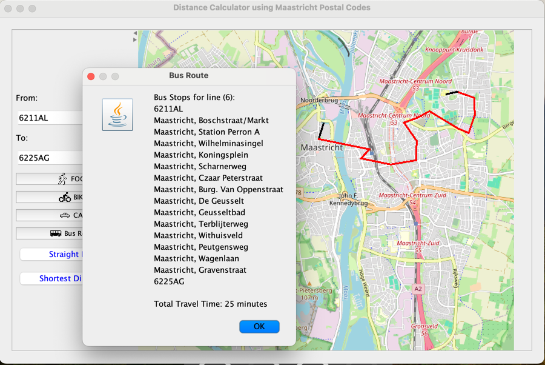
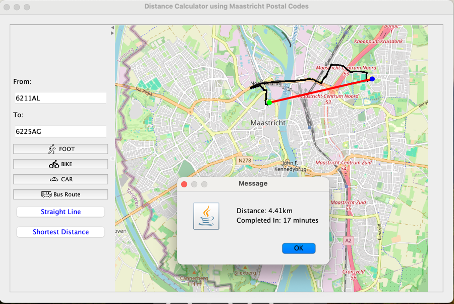

# **Project 1-2**
# Maastricht Transportation Application

## Overview
The Maastricht Transportation Application is a project developed by my project group. It aims to provide users with information on transportation options between two locations within Maastricht, Netherlands. The application allows users to input two postal codes and choose their preferred mode of transportation: Walk, Bike, Car, or Bus. It then calculates and displays the route, estimated time, and distance for the selected transportation mode.

## Features
- **Mode Selection**: Users can choose between Walk, Bike, Car, or Bus as their mode of transportation.
- **Routing**: The application calculates the route between two locations using either straight-line distance or the shortest distance based on a pathfinding algorithm.
- **Bus Information**: For Bus mode, the application retrieves data from a GTFS file containing information about bus routes and schedules. It then queries a server to find the shortest path and provides information on the bus route, stops, and estimated time.
- **Visualization**: The application visualizes the selected route on a map of Maastricht, allowing users to see their journey visually.
- **GUI**: The application is designed with a Graphical User Interface (GUI) for ease of use.
- **Time Selection**: Users can pick the time for their bus travels, choosing when they plan to leave.
- **Transfer Options**: Users can choose if they want transfers in bus routes, giving them more control over their travel plans.
- **Accessibility Score**: Displays a score for each neighborhood from 0 to 100 based on proximity to essential and non-essential amenities.

## Accessibility Score Calculation
The accessibility score for each neighborhood is based on proximity to various amenities. The amenities are categorized and weighted as follows:
- **Essential Shops (0.3)**: Supermarkets and malls providing food to inhabitants.
- **Essential Amenities (0.4)**: Banks, hospitals, doctor offices, pharmacies, schools, and universities providing essential services.
- **Non-Essential Shops (0.1)**: Other shops not considered essential.
- **Non-Essential Amenities (0.1)**: Amenities not considered essential.
- **Tourist Attractions (0.1)**: Attractions for tourists.

The calculated distance score is then multiplied by the weight assigned to each amenity category to derive the final accessibility score.

## Installation
To install and run the application, follow these steps:

1. Clone the repository: `git clone https://github.com/Amir-Mohseni/Project1-2.git`
2. Navigate to the project directory: `cd Project1-2`
3. Run the Maven installation script based on your operating system:
   - For Unix/Linux: `./maven_script.sh`
   - For Windows: `maven_script.bat`
4. If you want to populate your own database, use the Maastricht GTFS folder which contains the GTFS for only Maastricht using CSV files.

## Usage
1. Open the project in your preferred Java IDE.
2. Run the `GUI.java` file to launch the application.
3. Enter two postal codes for the starting and destination locations.
4. Choose your preferred mode of transportation.
5. Click on "Calculate Route" to view the route, estimated time, and distance.
6. Optionally, visualize the route on the map.

## Examples
Here are some examples of how to use the application:

**Example 1:**
- Select departure time: 08:00 AM
- Choose no transfers
- View accessibility score

**Example 2:**
- Select departure time: 03:00 PM
- Choose transfers
- View accessibility score

## Images

### Image 1: Time Selection Interface

### Image 2: Transfer Options Interface

### Image 3: Accessibility Score Display

## Dependencies
- Java Development Kit (JDK)
- Maven
- Python (for preprocessing GTFS file)
- Pandas (Python library)
- My work was mainly the Heerlan branch, titled Swae

## License
This project is licensed under the MIT License.

## Screenshots

